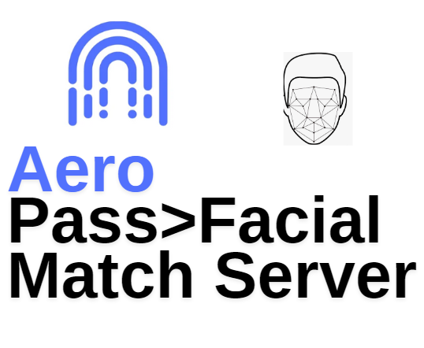

# Aeropass-facial-match-server
Matches Facial b64s to live selfies via Facenet (99 % declared score)

# Tech
-  TF/Python/Cmake/Dlib/OpenCV

  
# Exposed EP
- /verify
- /represent

# Model 
- Facenet 

> Works with Aeropass App and Aeropass Gate Controller
  
